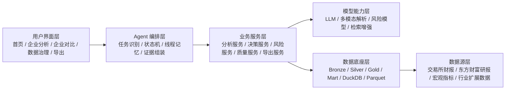
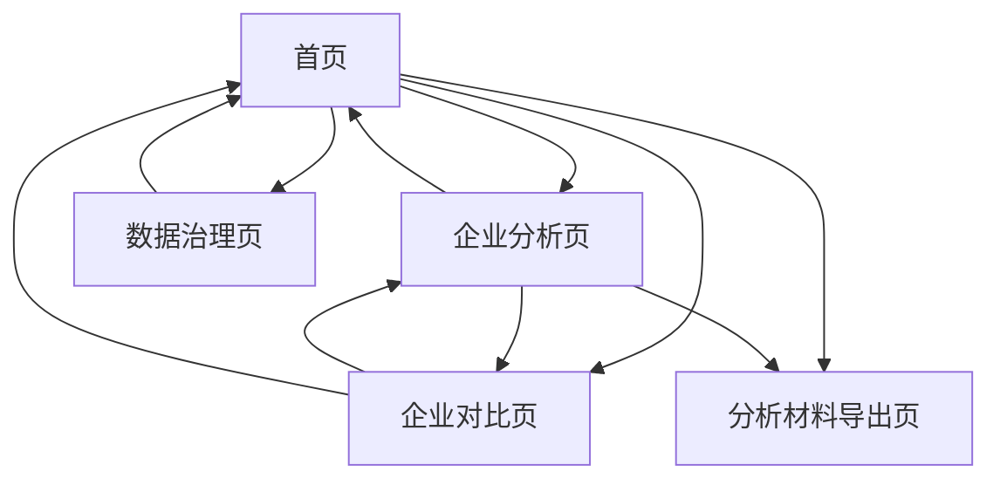
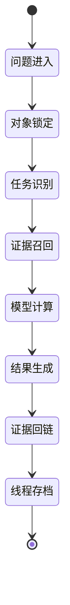
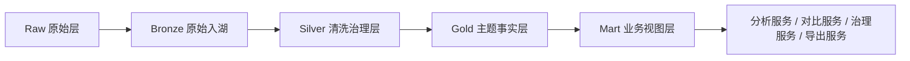

# 需求分析与软件设计报告

项目名称：企智策源  
副标题：智能体赋能的企业运营分析与决策支持系统  
版本：V1.0  
日期：2026-03-12

## 1. 报告目的

本报告用于统一项目的产品目标、需求边界、系统架构、数据路线、Agent 设计、模型设计与实施计划，作为后续所有开发、重构、补数、补模型、论文写作和比赛材料制作的正式基线。

本报告解决四个核心问题：

1. 这个项目到底做什么，不做什么。
2. 为什么当前系统会出现“想到哪做哪”的问题。
3. 后续开发应该先做什么，再做什么。
4. 如何把传统应用、Agent、深度学习和大数据真正融合成一个高水平作品。

## 2. 立项目标

### 2.1 项目定位

本项目必须被定义为一个面向真实用户的企业分析产品，而不是一个围绕展示效果拼接出来的临时比赛界面。

系统的最终目标是：

1. 为企业管理者、投研人员和风控人员提供统一的企业运营分析入口。
2. 使用 Agent 作为主要交互层，组织多源数据、模型能力和结构化分析流程。
3. 使用深度学习和多模态能力增强数据抽取、风险预测和证据解释。
4. 使用湖仓和批处理思维构建可扩展的数据底座，体现大数据赛道特征。

### 2.2 不做什么

当前阶段明确不做以下错误方向：

1. 不做纯大屏展示系统。
2. 不做纯聊天机器人。
3. 不做只有图表没有决策链路的分析后台。
4. 不做只会说“用了大模型”的包装式应用。
5. 不做一开始就依赖 Unity 或数字人才能成立的系统。

## 3. 赛题理解与高分逻辑

### 3.1 题目本质

题目要求的是“智能体赋能的企业运营分析与决策支持系统”，关键词有四个：

1. 智能体。
2. 企业运营分析。
3. 决策支持。
4. 系统。

这四个词决定了系统必须同时具备：

1. 智能交互。
2. 企业业务分析。
3. 证据驱动的判断与建议。
4. 完整的软件系统形态。

### 3.2 冲击特等奖必须同时满足的四层能力

1. 产品层：界面结构清楚、工作流完整、真正面向用户。
2. Agent 层：能理解问题、识别任务、调度能力、输出轨迹与证据。
3. AI 层：大模型、多模态、风险模型等能力真正入链。
4. 大数据层：高质量多源真实数据、湖仓分层、批处理和可扩展路线清楚。

### 3.3 项目当前最大问题

当前项目已经有了一个可运行的壳，但前期因为缺少统一设计报告，导致：

1. 页面职责发生混乱。
2. 有时围绕想法堆功能，而不是围绕需求收敛。
3. 用户界面曾混入面向比赛的词汇。
4. 个别页面出现重复输入、按钮对齐和视觉秩序问题。

这说明系统不是“做不出来”，而是“必须先立规矩再继续做”。

## 4. 总体设计原则

### 4.1 产品优先

比赛视角很重要，但用户视角优先于比赛口号。产品界面必须使用面向用户的语言。

因此，用户可见页面中禁止出现：

1. 比赛
2. 答辩
3. 赛题
4. 面向评委的解释文字

### 4.2 一个页面只做一件核心事

1. 首页只负责问答与全局指挥。
2. 企业分析页只负责看结果与证据。
3. 企业对比页只负责横向比较与差异解释。
4. 数据治理页只负责数据底座与质量控制。
5. 导出页只负责分析材料输出。

### 4.3 所有结论必须可追溯

任何结论、建议、风险提示都必须能够回到至少一个公开证据来源。

### 4.4 所有创新点必须落在系统里

创新点不能只写在文档里，必须能被用户在页面或接口中感知到。

### 4.5 先做稳，再做炫

Unity、数字人、沉浸式可视化是后续增强层，不是系统成立的前提。

## 5. 用户与场景分析

### 5.1 用户角色

#### 企业管理者

关注点：

1. 经营状态。
2. 风险与机会。
3. 决策动作建议。
4. 行业和宏观影响。

#### 投研分析人员

关注点：

1. 企业基本面。
2. 横向对比。
3. 数据时效。
4. 证据质量。

#### 风控与治理人员

关注点：

1. 风险识别。
2. 数据异常。
3. 模型可信度。
4. 人工复核与治理闭环。

### 5.2 核心使用场景

#### 场景一：单企业经营诊断

用户输入自然语言问题，系统识别企业对象与任务模式，返回结论、关键判断、行动建议和证据。

#### 场景二：企业横向对比

用户从首页或企业页进入企业对比页，对两家企业进行经营、风险、研报关注度和时效的横向判断。

#### 场景三：风险预警与监测

用户查看企业风险等级、高风险概率、关键驱动因子和建议监测指标。

#### 场景四：数据治理与可信度判断

用户查看数据覆盖、缺失、异常、多模态抽取进度和模型准备度，判断当前分析是否足够可靠。

#### 场景五：分析材料导出

用户针对单家企业生成结构化分析材料、引用证据和本地证据包。

## 6. 功能需求分析

### 6.1 首页

首页必须具备：

1. 唯一主问答入口。
2. 企业切换入口。
3. 任务模式切换。
4. 4 个以内的核心跳转入口。
5. 可点击的关键图表。
6. 重点风险、行业和宏观情报卡。

首页禁止具备：

1. 第二个问答入口。
2. 上传文档类用户交互。
3. 无意义的小字解释堆砌。
4. 非用户语言的界面文案。

### 6.2 企业分析页

企业分析页必须具备：

1. 结论摘要。
2. 经营分析。
3. 风险画像。
4. 证据资料。
5. 多模态财报锚点。
6. 回到首页与导出入口。

企业分析页禁止具备：

1. 嵌入式第二问答区。
2. 冗余任务流。
3. 和首页重复的提问行为。

### 6.3 企业对比页

企业对比页必须具备：

1. 对比结论。
2. 综合评分差异。
3. 风险差异。
4. 研报热度差异。
5. 财报时效差异。
6. 多模态财报差异。
7. 可点击证据流。

### 6.4 数据治理页

数据治理页必须具备：

1. 数据底座概览。
2. 湖仓层次与数据规模。
3. 定期披露覆盖。
4. 多模态抽取进度。
5. 模型产物与训练数据。
6. 空值热点字段。
7. Spark-ready 作业规划。

### 6.5 导出页

导出页必须具备：

1. 一键导出。
2. 章节提纲。
3. 引用清单。
4. 证据包路径。
5. Markdown 中间稿。

导出页不应成为第二个问答页。

### 6.6 非功能需求

#### 可用性

1. 首页 5 秒内让用户知道“能问什么、能去哪”。
2. 主按钮成组对齐，颜色对比清楚。
3. 用户看不到无意义灰字和设计噪音。

#### 可靠性

1. 线程上下文不丢。
2. 页面刷新后核心数据能恢复。
3. 数据和模型加载失败时有明确兜底。

#### 可追溯性

1. 结论引用来源明确。
2. 多模态锚点能打开页面图或原文。
3. 导出材料包含引用与证据包。

#### 可扩展性

1. 行业可扩展。
2. 企业池可扩展。
3. 计算引擎可扩展。
4. 模型体系可扩展。

## 7. 总体架构设计

### 7.1 系统分层

### 7.2 模块划分

1. 前端展示与交互模块。
2. Agent 线程与任务模块。
3. 企业分析模块。
4. 企业对比模块。
5. 风险预测模块。
6. 数据治理模块。
7. 导出模块。
8. 数据采集与湖仓模块。
9. 多模态抽取与训练数据模块。

## 8. 产品信息架构设计

### 8.1 页面结构

### 8.2 页面职责

#### 首页

角色：唯一主问答入口和全局指挥台。

#### 企业分析页

角色：企业结果与证据聚合页。

#### 企业对比页

角色：横向判断与证据验证页。

#### 数据治理页

角色：系统底座和数据可信度页。

#### 导出页

角色：分析材料输出页。

## 9. Agent 详细设计

### 9.1 Agent 模式

采用“主编排 Agent + 专项分析器”结构，而不是空转的多智能体叙事。

主编排 Agent 负责：

1. 问题理解。
2. 企业对象锁定。
3. 任务模式识别。
4. 服务调度。
5. 结果整合。
6. 线程记忆。

专项分析器包括：

1. 经营分析器。
2. 风险分析器。
3. 决策建议器。
4. 行业趋势分析器。
5. 数据治理分析器。
6. 多模态证据分析器。

### 9.2 Agent 状态流

### 9.3 线程记忆设计

线程记录以下信息：

1. 当前企业代码和名称。
2. 当前任务模式。
3. 历史问题。
4. 最近一次结论。
5. 最近一次证据摘要。
6. plan / trace。

## 10. 数据架构设计

### 10.1 数据源设计

当前主数据源：

1. 上交所、深交所、北交所官方定期报告。
2. 东方财富个股研报。
3. 东方财富行业研报。
4. 国家统计局宏观指标。

后续扩展数据源：

1. 行业政策和监管公告。
2. 行业协会和统计报告。
3. 企业公开新闻与投资者关系材料。
4. 医药行业公开业务数据。

### 10.2 湖仓设计

### 10.3 当前真实数据状态

截至 2026-03-12，本地真实状态如下：

1. 仓表与视图数量：17。
2. 总行数：9649。
3. 财务特征：55 行。
4. 个股研报：309 行。
5. 行业研报：1308 行。
6. 宏观指标：11 行。
7. 官方报告清单：21 行。
8. Parquet 产物：17 个。
9. Mart 视图：6 个。

### 10.4 时效数据设计

当前已打通：

1. 年报覆盖：6/6。
2. 一季报覆盖：6/6。
3. 半年报覆盖：6/6。
4. 三季报覆盖：6/6。

后续要继续扩展：

1. 更大企业池。
2. 更长时间跨度。
3. 更细颗粒度宏观指标。
4. 行业政策与专题数据。

### 10.5 数据质量治理设计

质量治理包括：

1. 覆盖率统计。
2. 空值热点检测。
3. 异常标记。
4. 多模态缺口标记。
5. 人工复核队列。
6. 数据可信度说明。

## 11. AI 与模型设计

### 11.1 大模型层

功能定位：

1. 用户问题理解。
2. 任务分解。
3. 多源证据整合。
4. 结果生成与压缩。
5. 推荐追问。

### 11.2 检索增强层

输入：

1. 个股研报。
2. 行业研报。
3. 财报结构化字段。
4. 宏观指标。

输出：

1. 语义召回结果。
2. 主题词。
3. 引用片段。
4. 证据清单。

### 11.3 多模态财报解析层

功能：

1. 图表解析。
2. 表格补齐。
3. 页锚点定位。
4. 页面图链接生成。

当前状态：

1. 抽取结果 8/21。
2. 已进入企业分析和企业对比证据链。
3. 已形成 8 条 SFT 样本。

### 11.4 风险模型层

功能：

1. 风险等级预测。
2. 高风险概率预测。
3. 风险因子解释。

当前产物：

1. `risk_tabular_model.json`
2. `risk_tabular.joblib`
3. `risk_tabular_metadata.json`

后续目标：

1. 纳入序列风险模型产物。
2. 建立统一模型管理。
3. 建立评测与版本记录。

### 11.5 微调与 ModelScope 路线

微调路线按以下顺序推进：

1. 继续扩充高质量 SFT 数据集。
2. 使用 ms-swift / ModelScope 做 LoRA 或 QLoRA 轻量试验。
3. 优先在多模态抽取和风险解释两个方向试验。
4. 建立训练、评测、落地一体化链路。

## 12. 大数据技术路线

### 12.1 当前形态

当前采用：

1. Python 批处理。
2. Parquet 湖仓。
3. DuckDB 分析仓。
4. Spark-ready 作业清单。

这已经具备“大数据工程思维”，但还不是最终形态。

### 12.2 下一阶段目标

1. 继续扩样到更大企业池。
2. 强化批处理和增量更新。
3. 为 Spark 迁移统一输入输出协议。
4. 为对象存储和调度系统留接口。

### 12.3 关键作业设计

当前规划的 Spark-ready 作业共 5 个：

1. `bronze_to_silver_governance`
2. `silver_to_gold_company_fact`
3. `multimodal_extract_batch`
4. `multimodal_sft_dataset_build`
5. `risk_model_training`

后续可继续补充：

1. 定期披露增量同步作业。
2. 研报热度增量更新作业。
3. 行业专题抽取作业。
4. 模型评测与回灌作业。

## 13. 接口与服务设计

### 13.1 前后端接口边界

前端负责：

1. 页面渲染。
2. 跳转与状态保持。
3. 用户交互。
4. 图表行为。

后端负责：

1. 聚合分析结果。
2. 风险预测。
3. 数据质量汇总。
4. 导出材料生成。
5. 静态证据资源暴露。

### 13.2 核心服务

1. `AnalyticsService`
2. `DecisionService`
3. `RiskService`
4. `DataQualityService`
5. `CompetitionReportService`
6. `AIStackService`

## 14. 安全与权限设计

### 14.1 权限边界

当前已有登录与角色能力，后续需要进一步规范：

1. 普通查看角色。
2. 分析员角色。
3. 管理员角色。

### 14.2 敏感能力控制

以下能力需要权限控制：

1. 导出材料。
2. 人工复核写入。
3. 高级审计查看。
4. 后台治理动作。

## 15. 当前实现基础与问题评估

### 15.1 已有基础

1. 首页、企业分析页、企业对比页、数据治理页、导出页已存在。
2. 线程恢复与任务模式恢复已打通。
3. 多模态证据已接入主链。
4. 定期披露时效已入链。
5. 数据底座页已能展示真实规模和缺口。

### 15.2 当前主要问题

1. 早期缺少正式设计报告。
2. 部分页面存在视觉秩序和按钮对齐问题。
3. 用户界面曾混入不该出现的比赛语言。
4. 个别页面曾出现重复输入或接近重复交互。
5. 数据规模和多模态覆盖率仍不足以形成最强冲击力。

## 16. 阶段实施计划

### 阶段一：设计收敛

目标：

1. 全面按本报告对齐页面职责。
2. 删除所有重复问答入口。
3. 统一用户界面文案。
4. 统一首页按钮、输入区和跳转区结构。

### 阶段二：数据补强

目标：

1. 继续扩核心企业和外围企业池。
2. 扩季度数据和行业数据。
3. 继续提升多模态抽取覆盖率。
4. 加强质量治理规则。

### 阶段三：模型补强

目标：

1. 扩充 SFT 数据集。
2. 引入轻量微调实验。
3. 强化风险模型管理和评测。
4. 让模型产物更稳定地进入页面。

### 阶段四：大数据补强

目标：

1. 补齐更完整的批处理体系。
2. 明确 Spark 迁移接口。
3. 强化增量同步和作业调度设计。

### 阶段五：展示增强

目标：

1. 强化驾驶舱图层。
2. 强化证据轨迹与回放。
3. 再视稳定度决定是否加入数字人和 Unity。

## 17. 验收标准

### 17.1 产品验收

1. 首页只有一个主问答入口。
2. 企业分析页没有第二问答区。
3. 按钮配色清楚，文字可读。
4. 首页问答框上方按钮在桌面端成组对齐。
5. 页面不再出现无意义灰字堆砌。

### 17.2 数据验收

1. 核心企业的年度和季度数据稳定可用。
2. 研报和行业数据保持时效。
3. 质量页能明确看到规模、缺口和治理动作。

### 17.3 AI 验收

1. 每次分析都有证据。
2. 多模态结果能被用户看见并打开。
3. 风险模型输出进入企业页和对比页。

### 17.4 大数据验收

1. 湖仓结构稳定。
2. 作业清单清楚。
3. 扩样时不推翻现有架构。
4. 可以明确讲出从当前单机湖仓到分布式计算的升级路线。

## 18. 结论

后续实现必须严格以本报告为基线：

1. 先收敛需求和系统结构。
2. 再继续推进页面、数据、模型和可视化。
3. 每一轮开发都要能回答“它属于哪个需求、哪个模块、哪条主线”。
4. 不允许继续凭感觉加模块。

本项目的正确推进方式不是“再堆几个功能”，而是：

`按正式需求与软件设计报告组织系统，再持续迭代实现。`
